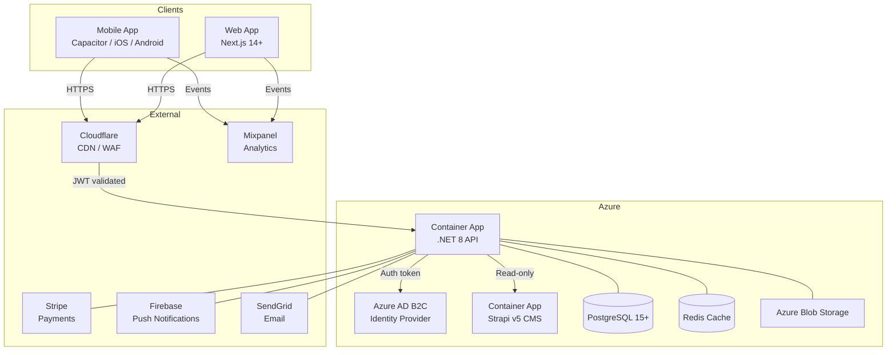
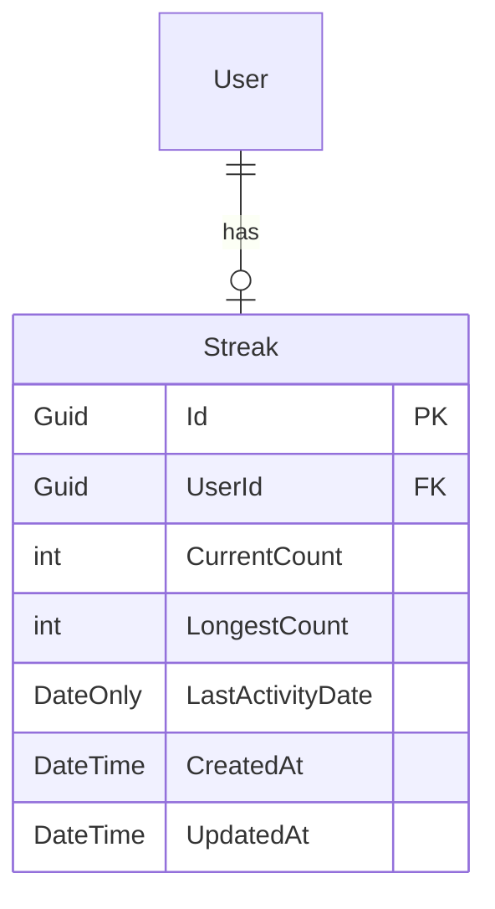
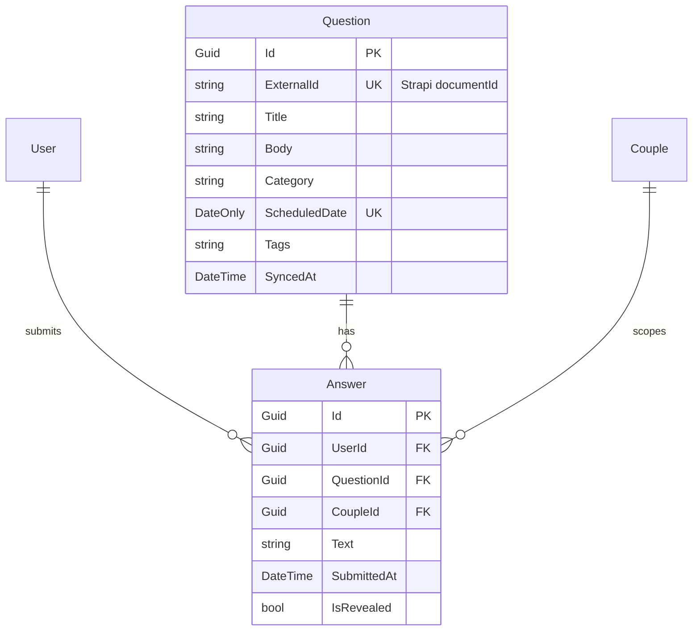

# Architecture Overview — birdie69

**Version:** 1.2  
**Date:** 2026-03-19  
**Author:** SA Agent  
**Status:** Active (Sprint 3 — Engagement Features)

---

## System Context

birdie69 is a multi-tier, cloud-native system hosted on Microsoft Azure.  
The architecture follows Clean Architecture principles with a .NET 8 API as the backbone,  
a Strapi CMS managing the question bank, and a Next.js + Capacitor app serving  
both web and mobile clients.



---

## API Architecture (.NET 8)

Follows **Clean Architecture** with strict layer separation:

```
birdie69-api/
├── src/
│   ├── Birdie69.Domain/          # Entities, Value Objects, Domain Events, Interfaces
│   ├── Birdie69.Application/     # Use Cases, Commands/Queries (CQRS/MediatR), DTOs
│   ├── Birdie69.Infrastructure/  # EF Core, Redis, Azure SDK, SendGrid, FCM clients
│   └── Birdie69.Api/             # ASP.NET Core controllers, middleware, DI config
└── tests/
    ├── Birdie69.Domain.Tests/
    ├── Birdie69.Application.Tests/
    └── Birdie69.Integration.Tests/
```

### Key Patterns

| Pattern | Usage |
|---------|-------|
| CQRS + MediatR | All application logic via Commands and Queries |
| Repository Pattern | Data access abstracted behind interfaces in Domain |
| EF Core + PostgreSQL | ORM for relational data |
| Result<T> / OneOf | Explicit error handling, no exceptions for business errors |
| Serilog | Structured logging to Azure Monitor |
| OpenTelemetry | Distributed tracing |
| FluentValidation | Command/Query input validation |
| AutoMapper | DTO ↔ Domain mappings |

---

## CMS Architecture (Strapi v5)

Strapi manages the **question bank** only — content editors can:
- Create, categorize, and schedule daily questions
- Manage question tags (intimacy, fun, deep, etc.)
- Preview questions before scheduling

The `.NET 8 API` calls Strapi's REST API (read-only) to fetch today's question.  
Strapi has no direct access to user data.

---

## Mobile / Web Architecture (Next.js 14+ + Capacitor)

```
birdie69-web/
├── src/
│   ├── app/          # Next.js App Router pages
│   ├── components/   # shadcn/ui-based component library
│   ├── lib/          # API clients, auth helpers
│   └── hooks/        # Custom React hooks
├── capacitor.config.ts
├── ios/              # Generated iOS project (Capacitor)
└── android/          # Generated Android project (Capacitor)
```

- **Web:** deployed to Azure Static Web Apps or Container App
- **Mobile (iOS + Android):** Capacitor wraps the Next.js build into native app shells
- **Native plugins:** Camera, Push Notifications, Haptics via Capacitor plugins
- **Styling:** Tailwind CSS + shadcn/ui

---

## Authentication Flow (Azure AD B2C)

```
User → Capacitor App
     → B2C Sign-In / Sign-Up flow (OAuth 2.0 + PKCE)
     ← ID Token + Access Token (JWT)
     → .NET 8 API (Bearer token in Authorization header)
     → API validates token against B2C JWKS endpoint
     → Extracts externalId (B2C Object ID) to identify user
```

- **External ID pattern**: B2C Object ID is the user identifier across all systems
- **Providers**: Apple Sign-In, Google Sign-In, Email Magic Link (passwordless)
- **No passwords stored** in the application database
- **Token lifecycle**: Access token (15 min), Refresh token (30 days), managed by B2C

---

## Infrastructure Architecture (Terraform)

Follows **Brick → Blueprint → Env** pattern:

```
birdie69-infra/
├── bricks/           # Reusable modules (container_app, postgres, redis, b2c, etc.)
├── blueprints/       # Composition of bricks for a specific environment type
│   └── app/          # Blueprint: full birdie69 stack
└── envs/
    ├── dev/          # Dev environment config
    ├── staging/      # Staging environment config
    └── prod/         # Production environment config
```

---

## Data Architecture

### Core Entities

| Entity | Description | Sprint introduced |
|--------|-------------|-------------------|
| `User` | Authenticated user (externalId = B2C Object ID) | Sprint 0 |
| `Couple` | Relationship between two Users (invite code, notification time preference) | Sprint 0 |
| `Question` | Daily question — local DB snapshot of the Strapi question | Sprint 2 |
| `Answer` | A user's answer to a question | Sprint 2 |
| `Streak` | Per-user daily engagement streak (CurrentCount, LongestCount, LastActivityDate) | Sprint 3 |

### Streak Domain Model (Sprint 3)

The `Streak` entity tracks a user's consecutive daily answer submissions. It is updated
via the `AnswerSubmittedEvent` domain event handler (Option A — stored counter, see ADR-008).



**Streak update flow:**
```
User submits answer → Answer.Submit() raises AnswerSubmittedEvent
  → AnswerSubmittedEventHandler (MediatR DomainEventNotification)
  → Load or create Streak for UserId
  → streak.RecordActivity(today)    // idempotent: no-op if IsActiveToday
  → Persist via IStreakRepository
GET /v1/streaks/me → StreakDto { currentCount, longestCount, lastActivityDate, isActiveToday }
```

**Key business rules:**
- Streak increments when the user submits their answer (per-user, not per-couple for MVP)
- `RecordActivity()` is idempotent — safe to re-process the event
- `IsActiveToday()` returns true if `LastActivityDate == today`
- See ADR-008 for streak calculation strategy and future couple-streak evolution path

---

### Question + Answer Domain Model (Sprint 2)



**Question lifecycle:**
1. Content editor creates question in Strapi with a `scheduledDate`.
2. On first `GET /v1/questions/today` of the day: API fetches from Strapi (Redis-cached),
   upserts a local `Question` row (idempotent, unique index on `ExternalId` + `ScheduledDate`).
3. Local `Question.Id` (Guid) is returned to clients as the stable reference.
4. `Answer.QuestionId` FK points to the local `Question.Id`.

**Answer reveal flow:**
```
User A submits answer → Answer(IsRevealed=false) stored
User B submits answer → Answer(IsRevealed=false) stored
                      → AnswerSubmittedEvent raised
                      → Both partners now answered
GET /v1/answers/{questionId}
  → BothPartnersAnsweredAsync = true
  → Returns AnswerRevealDto { isRevealed: true, myAnswer: ..., partnerAnswer: ... }
```

See **ADR-006** for the Question persistence strategy, **ADR-007** for the answer
reveal API contract, **ADR-008** for streak calculation strategy, and **ADR-009**
for push notification architecture.

### Key Business Rules

1. A user can only be in one active couple at a time
2. An answer can only be submitted once per question per user
3. Answers are revealed only when **both** partners have submitted (ADR-007)
4. `GET /v1/answers/{questionId}` always returns HTTP 200 with `isRevealed: bool` —
   the client uses `myAnswer`/`partnerAnswer` null-checks to determine render state
5. A new question is published daily at midnight UTC via Strapi `scheduledDate`
6. The local `Question` table is upserted on first `GET /questions/today` (ADR-006)
7. Push notifications are sent at a configurable time per couple (default: 08:00 local) — Sprint 4 delivery, Sprint 3 stores the preference (ADR-009)
8. A user's streak increments each day they submit an answer; `Streak.RecordActivity()` is idempotent (ADR-008)
9. `User.NotificationToken` stores the FCM device token for single-device push delivery (MVP); multi-device via `DeviceTokens` table is a future migration (ADR-009)

---

## API Design (API-First)

All endpoints follow REST conventions with OpenAPI 3.1 specification.

Base URL: `https://api.birdie69.app/v1`

### Core Endpoints

| Method | Path | Description | Sprint | OpenAPI Spec |
|--------|------|-------------|--------|-------------|
| GET | `/questions/today` | Get today's question (local Guid in response) | 2 | `api-specs/v1-questions.yaml` |
| POST | `/answers` | Submit an answer (body: `{ questionId: Guid, text }`) | 2 | `api-specs/v1-answers.yaml` |
| GET | `/answers/{questionId}` | Returns `AnswerRevealDto` with `isRevealed` flag (always 200) | 2 | `api-specs/v1-answers.yaml` |
| GET | `/couples/me` | Get current couple info | 1 | `api-specs/v1-couple.yaml` |
| POST | `/couples` | Create couple + generate invite code | 1 | `api-specs/v1-couple.yaml` |
| POST | `/couples/join` | Join via invite code | 1 | `api-specs/v1-couple.yaml` |
| DELETE | `/couples/me` | Leave / disband couple | 1 | `api-specs/v1-couple.yaml` |
| GET | `/users/me` | Get own profile | 1 | — |
| PUT | `/users/me` | Update profile | 1 | — |
| GET | `/streaks/me` | Get current user's streak info | 3 | — |
| GET | `/answers/history` | Paginated Q&A history (cursor-based) | 3 | — |
| PUT | `/couples/me/notification-time` | Set couple notification time preference | 3 | — |
| PUT | `/users/me/notification-token` | Register FCM device token | 3 | — |

---

## Security Architecture

| Concern | Solution |
|---------|----------|
| Authentication | Azure AD B2C (OAuth 2.0 + PKCE) |
| API Authorization | JWT Bearer tokens, validated by ASP.NET Core middleware |
| Data in Transit | TLS 1.3 everywhere |
| Data at Rest | Azure-managed encryption (AES-256) |
| Secrets Management | Azure Key Vault (accessed via Managed Identity) |
| WAF | Cloudflare WAF (OWASP Top 10 protection) |
| Rate Limiting | API Gateway level + .NET middleware |
| CORS | Strict allowlist (birdie69 domains only) |

---

## Observability

| Signal | Tool |
|--------|------|
| Logging | Serilog → Azure Monitor Log Analytics |
| Tracing | OpenTelemetry → Azure Monitor Application Insights |
| Metrics | Prometheus → Azure Monitor |
| Alerting | Azure Monitor Alerts → PagerDuty / Email |
| Dashboards | Azure Dashboards / Grafana |
