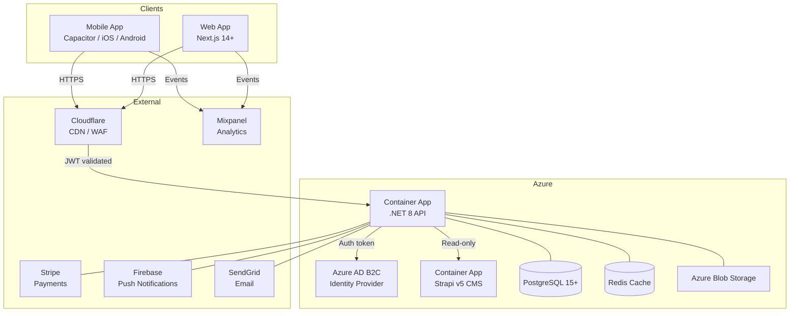

# Architecture Overview — birdie69

**Version:** 1.0  
**Date:** 2026-02-14  
**Author:** SA Agent  
**Status:** Draft (pre-implementation)

---

## System Context

birdie69 is a multi-tier, cloud-native system hosted on Microsoft Azure.  
The architecture follows Clean Architecture principles with a .NET 8 API as the backbone,  
a Strapi CMS managing the question bank, and a Next.js + Capacitor app serving  
both web and mobile clients.



---

## API Architecture (.NET 8)

Follows **Clean Architecture** with strict layer separation:

```
birdie69-api/
├── src/
│   ├── Birdie69.Domain/          # Entities, Value Objects, Domain Events, Interfaces
│   ├── Birdie69.Application/     # Use Cases, Commands/Queries (CQRS/MediatR), DTOs
│   ├── Birdie69.Infrastructure/  # EF Core, Redis, Azure SDK, SendGrid, FCM clients
│   └── Birdie69.Api/             # ASP.NET Core controllers, middleware, DI config
└── tests/
    ├── Birdie69.Domain.Tests/
    ├── Birdie69.Application.Tests/
    └── Birdie69.Integration.Tests/
```

### Key Patterns

| Pattern | Usage |
|---------|-------|
| CQRS + MediatR | All application logic via Commands and Queries |
| Repository Pattern | Data access abstracted behind interfaces in Domain |
| EF Core + PostgreSQL | ORM for relational data |
| Result<T> / OneOf | Explicit error handling, no exceptions for business errors |
| Serilog | Structured logging to Azure Monitor |
| OpenTelemetry | Distributed tracing |
| FluentValidation | Command/Query input validation |
| AutoMapper | DTO ↔ Domain mappings |

---

## CMS Architecture (Strapi v5)

Strapi manages the **question bank** only — content editors can:
- Create, categorize, and schedule daily questions
- Manage question tags (intimacy, fun, deep, etc.)
- Preview questions before scheduling

The `.NET 8 API` calls Strapi's REST API (read-only) to fetch today's question.  
Strapi has no direct access to user data.

---

## Mobile / Web Architecture (Next.js 14+ + Capacitor)

```
birdie69-web/
├── src/
│   ├── app/          # Next.js App Router pages
│   ├── components/   # shadcn/ui-based component library
│   ├── lib/          # API clients, auth helpers
│   └── hooks/        # Custom React hooks
├── capacitor.config.ts
├── ios/              # Generated iOS project (Capacitor)
└── android/          # Generated Android project (Capacitor)
```

- **Web:** deployed to Azure Static Web Apps or Container App
- **Mobile (iOS + Android):** Capacitor wraps the Next.js build into native app shells
- **Native plugins:** Camera, Push Notifications, Haptics via Capacitor plugins
- **Styling:** Tailwind CSS + shadcn/ui

---

## Authentication Flow (Azure AD B2C)

```
User → Capacitor App
     → B2C Sign-In / Sign-Up flow (OAuth 2.0 + PKCE)
     ← ID Token + Access Token (JWT)
     → .NET 8 API (Bearer token in Authorization header)
     → API validates token against B2C JWKS endpoint
     → Extracts externalId (B2C Object ID) to identify user
```

- **External ID pattern**: B2C Object ID is the user identifier across all systems
- **Providers**: Apple Sign-In, Google Sign-In, Email Magic Link (passwordless)
- **No passwords stored** in the application database
- **Token lifecycle**: Access token (15 min), Refresh token (30 days), managed by B2C

---

## Infrastructure Architecture (Terraform)

Follows **Brick → Blueprint → Env** pattern:

```
birdie69-infra/
├── bricks/           # Reusable modules (container_app, postgres, redis, b2c, etc.)
├── blueprints/       # Composition of bricks for a specific environment type
│   └── app/          # Blueprint: full birdie69 stack
└── envs/
    ├── dev/          # Dev environment config
    ├── staging/      # Staging environment config
    └── prod/         # Production environment config
```

---

## Data Architecture

### Core Entities

| Entity | Description |
|--------|-------------|
| `User` | Authenticated user (externalId = B2C Object ID) |
| `Couple` | Relationship between two Users (invite code) |
| `Question` | Daily question (sourced from Strapi) |
| `Answer` | A user's answer to a question |
| `AnswerReveal` | Record of when answers were revealed |
| `Streak` | Daily engagement streak for a user |
| `Notification` | Scheduled push notification record |

### Key Business Rules

1. A user can only be in one active couple at a time
2. An answer can only be submitted once per question per user
3. Answers are revealed only when **both** partners have submitted
4. A new question is published daily at midnight UTC
5. Push notifications are sent at a configurable time per couple (default: 8:00 AM local)

---

## API Design (API-First)

All endpoints follow REST conventions with OpenAPI 3.1 specification.

Base URL: `https://api.birdie69.app/v1`

### Core Endpoints (MVP)

| Method | Path | Description |
|--------|------|-------------|
| GET | `/questions/today` | Get today's question |
| POST | `/answers` | Submit an answer |
| GET | `/answers/{questionId}` | Get answers (only after both submitted) |
| GET | `/couple` | Get current couple info |
| POST | `/couple/invite` | Generate invite code |
| POST | `/couple/join` | Join via invite code |
| GET | `/history` | Paginated Q&A history |
| GET | `/profile` | Get own profile |
| PUT | `/profile` | Update profile |

---

## Security Architecture

| Concern | Solution |
|---------|----------|
| Authentication | Azure AD B2C (OAuth 2.0 + PKCE) |
| API Authorization | JWT Bearer tokens, validated by ASP.NET Core middleware |
| Data in Transit | TLS 1.3 everywhere |
| Data at Rest | Azure-managed encryption (AES-256) |
| Secrets Management | Azure Key Vault (accessed via Managed Identity) |
| WAF | Cloudflare WAF (OWASP Top 10 protection) |
| Rate Limiting | API Gateway level + .NET middleware |
| CORS | Strict allowlist (birdie69 domains only) |

---

## Observability

| Signal | Tool |
|--------|------|
| Logging | Serilog → Azure Monitor Log Analytics |
| Tracing | OpenTelemetry → Azure Monitor Application Insights |
| Metrics | Prometheus → Azure Monitor |
| Alerting | Azure Monitor Alerts → PagerDuty / Email |
| Dashboards | Azure Dashboards / Grafana |
