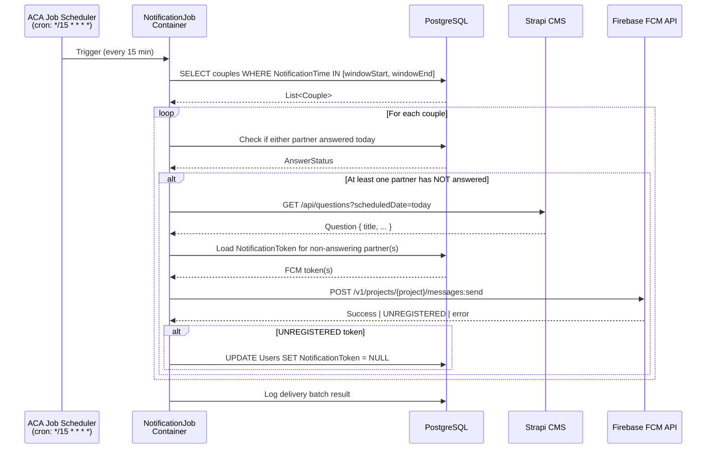

# ADR-010: Sprint 4 — FCM Notification Delivery + Tech Debt Resolutions

**Date:** 2026-04-24  
**Status:** Accepted  
**Deciders:** Instructor, SA Agent  
**Category:** Backend / Infrastructure / Security  
**Supersedes (partial):** ADR-009 § Sprint 4 delivery mechanism (Azure Functions → ACA Jobs)

---

## Context

Sprint 4 delivers the FCM push notification system designed in ADR-009 (token storage
and preference data already captured in Sprint 3). This ADR documents:

1. **Tech debt resolutions** required before any staging/production deployment:
   - B69-21: Dev JWT bypass gate strategy
   - B69-22: Strapi public role / no-auth access
   - B69-23: Secret management strategy

2. **FCM delivery architecture** decisions:
   - Q1: Delivery mechanism (Azure Functions vs BackgroundService vs ACA Jobs)
   - Q2: Firebase project setup strategy
   - Q3: Notification content
   - Q4: Multi-device token support

---

## Tech Debt Decisions

### B69-21: Dev JWT Bypass Gate

**Decision: Option C — `builder.Environment.IsDevelopment()` guard**

The `OnMessageReceived` handler that mints dev JWTs for arbitrary Bearer strings must be
wrapped in an `if (builder.Environment.IsDevelopment())` block. This is the idiomatic
.NET approach, requires zero additional configuration, and is automatically disabled in
any environment where `ASPNETCORE_ENVIRONMENT` is set to `Staging` or `Production`.

```csharp
// Program.cs
if (builder.Environment.IsDevelopment())
{
    // Dev-only: accept "alice" / "bob" etc. as signed dev JWTs
    options.Events = new JwtBearerEvents
    {
        OnMessageReceived = ctx =>
        {
            // ... dev bypass handler ...
            return Task.CompletedTask;
        }
    };
}
```

**Deploy requirement:** All non-dev Container App environments must set
`ASPNETCORE_ENVIRONMENT=Staging` (or `Production`). This is enforced via Terraform
env vars in `envs/staging/main.tf` and `envs/prod/main.tf`. Documented in the
DevOps runbook.

#### Options Considered

| Option | Pros | Cons |
|--------|------|------|
| A — `ENABLE_DEV_AUTH=true` env var | Explicit, extra gate | Extra config surface; can be accidentally set in staging |
| **C — `IsDevelopment()` (chosen)** | Idiomatic .NET; zero extra config; off by default in all non-dev envs | None significant |
| B — `#if DEBUG` | Compile-time guarantee | Ships Release builds in containers; `#if DEBUG` would be false — same as deleting the code |
| D — Remove entirely | Maximum safety | Breaks local dev workflow for all contributors |

---

### B69-22: Strapi Public Role / No-Auth Access

**Decision: Option C — Read-only API token + VNet isolation (phased)**

- **Phase 1 (Sprint 4):** Generate a Strapi read-only API token; store it in Azure Key
  Vault as `strapi-read-token`; inject into the API container as `STRAPI_READ_TOKEN`
  via Managed Identity. The `.NET 8 API`'s `StrapiFetchService` already reads
  `ReadToken` from config and passes it as `Authorization: Bearer {token}`.
- **Phase 2 (Infra sprint):** Place the Strapi Container App inside the ACA internal
  environment (no public ingress). All Strapi access goes through the API container
  over the private VNET. External internet cannot reach Strapi directly.

Both layers together form defense-in-depth. Phase 1 is immediately actionable;
Phase 2 is Terraform work deferred to the infra hardening sprint.

#### Options Considered

| Option | Pros | Cons |
|--------|------|------|
| A — Read-only token only | Easy, already designed | Strapi still publicly reachable; token can be stolen from traffic |
| B — VNet only | Network-level isolation | Still no app-level auth; complex Terraform change |
| **C — Both A + B, phased (chosen)** | Defense-in-depth; Phase 1 unblocks staging now | Phase 2 requires VNet Terraform work |

---

### B69-23: Secret Management Strategy

**Decision: Option C — Azure Key Vault (runtime) + GitHub Actions Secrets (deploy-time)**

| Secret type | Storage | Access pattern |
|-------------|---------|---------------|
| DB connection string, Redis URL, Strapi token, Firebase service account | Azure Key Vault | Container App Managed Identity → Key Vault ref in env vars |
| `AZURE_CREDENTIALS`, container registry credentials, Key Vault URI | GitHub Actions Secrets | CI/CD pipeline only; never in containers |

Key Vault is already scaffolded in the Terraform bricks. The `envs/staging/main.tf`
and `envs/prod/main.tf` must reference Key Vault secret URIs in the Container App
env var definitions (using `secretRef` in ACA).

**Local dev:** `.env` files (git-ignored). No secrets in repo history.

#### Options Considered

| Option | Pros | Cons |
|--------|------|------|
| A — Key Vault only | Runtime secrets covered | Deploy pipeline still needs credentials somewhere |
| B — GitHub Secrets only | Simple CI/CD | Secrets not available at runtime without extra indirection |
| **C — Both (chosen)** | Clean separation of concerns; follows Azure Well-Architected Framework | Slightly more setup |

---

## FCM Delivery Architecture Decisions

### Q1 — Delivery Mechanism

**Decision: Option C — Azure Container Apps Jobs (scheduled)**

A dedicated **ACA Job** runs on a cron schedule (`*/15 * * * *`) every 15 minutes.
It queries couples whose `NotificationTime` falls within the current 15-minute window
and dispatches FCM messages for partners who have not yet answered today's question.

**Why ACA Jobs over Azure Functions (ADR-009 recommendation):**
- The project infrastructure is entirely Azure Container Apps. An ACA Job reuses the
  same Terraform `container_app` brick, the same container registry, and the same
  ACA environment — no separate Azure Functions service to provision, deploy, or monitor.
- ACA Jobs have no cold start penalty (unlike Functions Consumption plan).
- Single deployment pipeline: the notification job is another image in the same
  `docker-compose.yml` / Dockerfile setup, deployed via the same `ghcr.io` registry.
- ACA Jobs reached full GA with mature tooling (2025); the "less documentation" concern
  in the original options is no longer a significant factor.

**This decision partially supersedes ADR-009's Sprint 4 delivery mechanism.**
All other ADR-009 decisions (token storage, preference model, 15-min window,
FCM invalid-token cleanup) remain unchanged.

#### Options Considered

| Option | Pros | Cons |
|--------|------|------|
| A — Azure Functions Timer Trigger | Independent scaling; natural cron | Extra Azure resource; separate deploy pipeline; cold start risk on Consumption plan |
| B — .NET BackgroundService in API container | No extra infra; shared DI | Runs on API pod; needs distributed lock for multi-instance; restart clears schedule |
| **C — ACA Jobs (chosen)** | Infrastructure consistency; same Terraform brick; no cold start; single container registry | Cron resolution is 1 min (same as Functions); slightly less Functions-ecosystem tooling |

#### ACA Job — Sequence Diagram



#### ACA Job — Infrastructure

```
birdie69-infra/
├── bricks/
│   └── notification_job/        # New brick (wraps ACA Job resource)
│       ├── main.tf
│       ├── variables.tf
│       └── outputs.tf
├── blueprints/
│   └── app/
│       └── main.tf              # Wire notification_job brick here
└── envs/
    ├── staging/main.tf          # Job image tag + env vars
    └── prod/main.tf
```

---

### Q2 — Firebase Project Setup

**Decision: Option B + C hybrid — `INotificationSender` stub + Firebase Emulator**

**Phase 1 — Unblock Sprint 4 development (immediate):**

Define `INotificationSender` in the Application layer. Provide a `StubNotificationSender`
implementation in Infrastructure that logs the would-be payload instead of calling FCM.
All Sprint 4 code is written against the interface; tests use the stub.

```csharp
// Application layer interface
public interface INotificationSender
{
    Task<NotificationResult> SendAsync(
        string deviceToken,
        NotificationPayload payload,
        CancellationToken cancellationToken = default);
}

// Infrastructure/Stub (local dev + tests)
internal sealed class StubNotificationSender : INotificationSender
{
    private readonly ILogger<StubNotificationSender> _logger;

    public Task<NotificationResult> SendAsync(
        string deviceToken, NotificationPayload payload, CancellationToken ct)
    {
        _logger.LogInformation(
            "[STUB] Would send FCM to {Token}: {Title} — {Body}",
            deviceToken, payload.Title, payload.Body);
        return Task.FromResult(NotificationResult.Success);
    }
}

// Infrastructure/Firebase (staging + prod)
internal sealed class FirebaseNotificationSender : INotificationSender
{
    // Uses FirebaseAdmin SDK; service account JSON from Key Vault
}
```

DI registration (controlled by environment/config flag):
```csharp
if (builder.Environment.IsProduction() || builder.Environment.IsStaging())
    services.AddSingleton<INotificationSender, FirebaseNotificationSender>();
else
    services.AddSingleton<INotificationSender, StubNotificationSender>();
```

**Phase 2 — Firebase project setup (pre-staging deploy):**

1. Create Firebase project in Firebase Console.
2. Generate service account JSON (`firebase-adminsdk-*.json`).
3. Store JSON content in Azure Key Vault as `firebase-service-account-json`.
4. `FirebaseNotificationSender` reads Key Vault secret via Managed Identity.
5. Optionally configure Firebase Emulator locally (`firebase.json` in `birdie69-api/`).

**Phase 3 — Optional local emulator:**
For developers who want to test real FCM flow locally without a prod Firebase project,
a `firebase.json` emulator config can be added. The `StubNotificationSender` covers
unit/integration test needs; the emulator is opt-in.

#### Options Considered

| Option | Pros | Cons |
|--------|------|------|
| A — Real Firebase now | Full e2e testable immediately | Blocks Sprint 4 dev on Firebase project setup; premature for non-prod |
| **B + C hybrid (chosen)** | Unblocks dev immediately; clean interface pattern; real Firebase when ready | Two implementations to maintain (short-lived) |
| C — Emulator only | No prod Firebase account needed | Emulator setup overhead; not all FCM features emulated |

---

### Q3 — Notification Content

**Decision: Option B — Include question title**

The ACA Job already fetches today's question to determine eligibility (whether partners
have answered). The question title is available at zero additional cost. Including it
in the notification body increases engagement by giving users a preview.

```
Title: "Time to connect 💬"
Body:  "{QuestionTitle} — tap to answer together."
Data:  {
    "type": "daily_reminder",
    "questionId": "{local-question-guid}"
}
```

For couples where both partners have already answered:
```
Title: "You're in sync! 🐦"
Body:  "You both answered today. Check back tomorrow!"
```
(No push sent — eligibility check filters these out.)

**This updates the notification content template in ADR-009.**

#### Options Considered

| Option | Pros | Cons |
|--------|------|------|
| A — Generic "Your daily question is ready!" | Simplest; no Strapi call needed in job | Lower engagement; wastes push budget |
| **B — Include question title (chosen)** | Higher open rate; question context drives urgency; Strapi call already needed for eligibility | Requires Strapi available at job runtime (mitigated by Redis cache) |
| C — Per-couple personalization | Maximum engagement | Deferred — out of Sprint 4 scope |

---

### Q4 — Multi-Device Support

**Decision: Option A — Keep single `User.NotificationToken` (MVP)**

No change from ADR-009. The `User.NotificationToken (string?)` column is sufficient
for MVP. Multi-device migration path is fully documented in ADR-009 § Future Migration Path.

Sprint 4 does not implement `DeviceTokens` table.

#### Options Considered

| Option | Pros | Cons |
|--------|------|------|
| **A — Single token (chosen)** | Zero migration; ADR-009 migration path documented | One active device per user |
| B — DeviceTokens table now | Multi-device ready | Over-engineered for MVP; extra EF migration |
| C — Defer | Same as A | Same as A |

---

## Domain Model Changes (Sprint 4)

No new entities. The following **Application layer** additions are required:

### New Commands / Queries

```
Application/
├── Notifications/
│   ├── Commands/
│   │   └── SendDailyNotificationsCommand.cs   # Dispatched by ACA Job entry point
│   └── Queries/
│       └── GetCouplesDueForNotificationQuery.cs
```

### New Infrastructure Implementations

```
Infrastructure/
├── Notifications/
│   ├── StubNotificationSender.cs
│   ├── FirebaseNotificationSender.cs
│   └── NotificationPayload.cs
```

### ACA Job Entry Point (separate project)

```
birdie69-notification-job/
├── Program.cs              # Minimal host; DI wires Application + Infrastructure
├── NotificationJobWorker.cs
└── Dockerfile
```

The job project references `Birdie69.Application` and `Birdie69.Infrastructure` NuGet
packages (or project references if in a monorepo solution).

---

## Updated Notification Content (supersedes ADR-009 § Notification Content)

### Daily reminder (partners pending)
```
Title: "Time to connect 💬"
Body:  "{QuestionTitle} — tap to answer together."
Data:  { "type": "daily_reminder", "questionId": "{guid}" }
```

### Partner answered notification (Sprint 5+ — unchanged from ADR-009)
```
Title: "{PartnerName} answered!"
Body:  "Tap to see what they said."
Data:  { "type": "partner_answered", "questionId": "{guid}" }
```

---

## Consequences

### Positive
- ACA Jobs reuse existing Terraform infrastructure — no new Azure service type
- `INotificationSender` interface pattern keeps Application layer clean; Firebase
  implementation can be swapped in without changing any use case handlers
- Question title in notification body increases engagement at zero infrastructure cost
- All tech debt gates (B69-21, B69-22, B69-23) have clear, immediately actionable plans
- Firebase service account in Key Vault follows Security by Default principle (global.md)

### Negative
- ACA Job is a third deployable artifact (API container, CMS container, Job container)
- Firebase Emulator adds optional local setup overhead for contributors who want e2e testing
- VNet isolation (B69-22 Phase 2) deferred — Strapi remains publicly reachable until infra sprint

### Future
- **Timezone support:** Add `Couple.TimezoneId` — ACA Job converts `NotificationTime`
  from couple-local to UTC before window query. Warrants ADR-011.
- **Partner-answered push (Sprint 5):** Wire `AnswerRevealedEvent` to
  `INotificationSender` directly from the domain event handler in the API.
- **Multi-device (post-MVP):** Follow ADR-009 § Future Migration Path to add
  `DeviceTokens` table.
- **Notification opt-out:** Add `User.NotificationsEnabled (bool)` flag.

---

## Open Questions for PM Agent

1. **Timezone UX:** The `NotificationTime` is stored as a `TimeOnly` without timezone.
   Should the Sprint 4 UI allow timezone selection, or is UTC+local device time
   acceptable for the initial release? **AC implication:** If local time is required,
   `Couple.TimezoneId` field + ADR-011 needed before first user-facing push goes live.

2. **Notification opt-out:** Should users be able to disable push notifications
   per-user (not just per-couple)? **AC implication:** If yes, `User.NotificationsEnabled`
   flag needed; the ACA Job query must filter it.

3. **"Both answered" suppression:** If both partners have already answered today,
   should the job suppress the notification silently, or send a "You're both in sync!"
   encouragement push? **AC implication:** Determines eligibility logic and whether a
   new notification type needs a UI deep-link.

4. **Firebase project ownership:** Who creates/owns the Firebase project? Is this a
   PM/Instructor action, or should it be scaffolded via terraform (firebase
   Terraform provider)? **AC implication:** Firebase project setup is a blocker for
   staging e2e push testing.

5. **B69-22 Phase 2 timing:** When is the VNet isolation sprint scheduled? Strapi
   is publicly accessible until then — is that acceptable for the staging deployment?

---

## References

- ADR-009: Push Notification Architecture (partial supersession of Q2/delivery mechanism)
- ADR-004: Infrastructure — Azure Container Apps
- ADR-003: Backend — .NET 8 Clean Architecture
- [Azure Container Apps Jobs](https://learn.microsoft.com/en-us/azure/container-apps/jobs)
- [Firebase Admin SDK for .NET](https://firebase.google.com/docs/admin/setup)
- [Azure Key Vault — Container Apps Secret References](https://learn.microsoft.com/en-us/azure/container-apps/manage-secrets)
- `src/Birdie69.Domain/Entities/User.cs` — `NotificationToken` field
- `src/Birdie69.Domain/Entities/Couple.cs` — `NotificationTime` field
