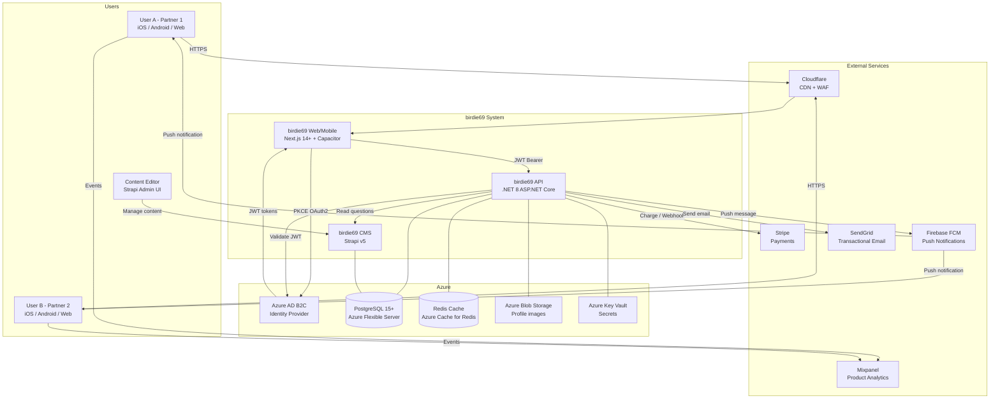
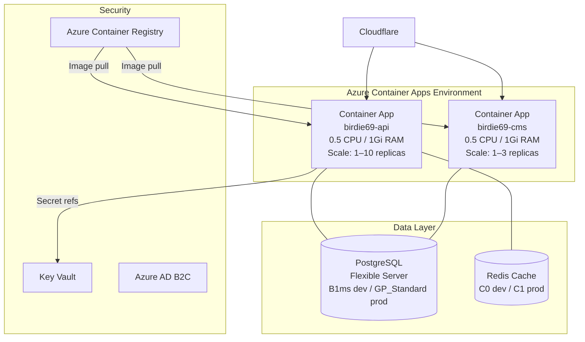

# System Context — birdie69

**Version:** 1.0  
**Date:** 2026-02-14  
**Author:** SA Agent

---

## System Context Diagram

---

## Key Interactions

### User Authentication
1. User opens app → MSAL redirects to Azure AD B2C
2. User signs in (Apple / Google / Magic Link)
3. B2C issues ID Token + Access Token (JWT)
4. App stores tokens securely (Capacitor Secure Storage)
5. All API calls include `Authorization: Bearer <access_token>`
6. API validates token against B2C JWKS endpoint on every request

### Daily Question Flow
1. Content editor creates question in Strapi CMS (scheduled for a date)
2. At midnight UTC, `birdie69-api` fetches the new question from Strapi
3. Question is cached in Redis (TTL = seconds until next midnight)
4. FCM sends push notification to all registered users
5. User opens app → GET /v1/questions/today → receives cached question

### Answer Reveal Flow
1. User A submits answer → POST /v1/answers → stored, flagged as "not revealed"
2. User A sees "Waiting for [Partner]..."
3. User B submits answer → POST /v1/answers
4. API detects both partners answered → sets `revealed = true`
5. FCM push: "Your partner answered! See their response."
6. Both GET /v1/answers/{questionId} → both answers visible

---

## Deployment Architecture

